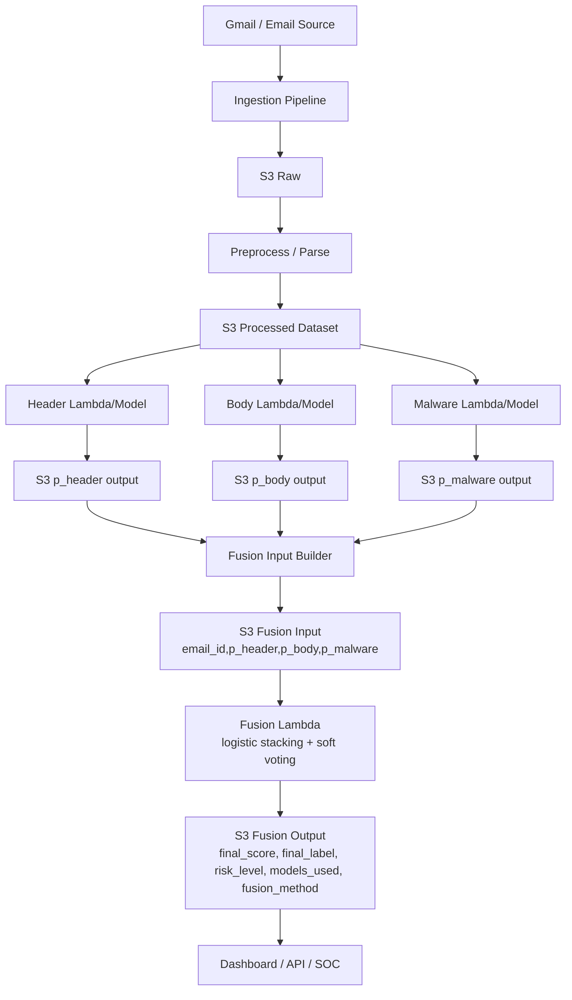

# Fusion Layer for Multi-Model Cyber-Threat Analysis

This project implements a **standalone late-fusion layer** for a multi-model cyber-threat analysis pipeline. It starts **after upstream model prediction is already available** and combines the probability outputs from three specialized models:

1. **Header model**
2. **Body model**
3. **Malware / attachment model**

The fusion layer is designed for **Phase 1** requirements where the team must use **late fusion**, not end-to-end neural fusion. The primary fusion method is **logistic regression stacking**, and the baseline method is **soft voting**.

Detailed fusion-model documentation is available in `MODEL_DOCUMENTATION.md`.

---

## Why this fusion layer exists

Upstream ingestion, AWS/S3 processing, and base-model training are intentionally out of scope here. This module assumes those parts of the platform already produce model-level probabilities per email.

The fusion layer is responsible for:

- validating those model outputs,
- handling missing modalities,
- combining them into a final threat score,
- mapping the score to a human-readable risk level,
- and returning an operationally simple final decision artifact.

This makes the fusion layer easy to maintain, easy to explain, and easy to integrate into the larger cyber analytics capstone platform.

---

## Phase 1 fusion approach

### Primary method: logistic regression stacking

The logistic fusion model takes the model probabilities as late-fusion inputs:

- `p_header`
- `p_body`
- `p_malware`

To support missing modalities, the stacking model also uses explicit **missingness indicators**:

- `has_header`
- `has_body`
- `has_malware`
- `models_present_count`

Missing probability values are filled with a configurable neutral value (`0.50` by default), while the missingness indicators tell the model which modalities were actually present.

### Baseline method: soft voting

Soft voting computes a simple average over the probabilities that are actually present.

Example:

- `p_header = 0.10`
- `p_body = 0.22`
- `p_malware = missing`

Soft voting score = `(0.10 + 0.22) / 2 = 0.16`

Missing malware is **not** forced into the average for the baseline.

---

## Input and output contracts

### Training input contract

CSV columns:

```csv
email_id,p_header,p_body,p_malware,true_label
```

Rules:

- `email_id` must be present and unique
- `p_header`, `p_body`, `p_malware` must be probabilities in `[0.0, 1.0]` or blank
- at least one model probability must be present for every row
- `true_label` must be `0` or `1`

Example:

```csv
email_id,p_header,p_body,p_malware,true_label
e1,0.81,0.67,0.92,1
e2,0.10,0.22,,0
e3,0.54,0.61,0.18,1
```

### Inference input contract

CSV columns:

```csv
email_id,p_header,p_body,p_malware
```

Rules:

- same validation rules as training input, except there is no `true_label`
- blank `p_malware` is expected when an email has no attachment or no malware-model output

### Fusion output contract

CSV columns:

```csv
email_id,final_score,final_label,risk_level,models_used,fusion_method
```

Field meanings:

- `final_score`: fused probability in `[0.0, 1.0]`
- `final_label`: binary decision using the configurable threshold (`0.50` by default)
- `risk_level`: mapped from the score bands below
- `models_used`: which source model scores were present, e.g. `header|body` or `header|body|malware`
- `fusion_method`: either `soft_voting` or `logistic_regression_stacking`

---

## Risk mapping

The project implements the professor's required risk bands:

- `0.00 <= score < 0.30` → `low / benign`
- `0.30 <= score < 0.70` → `medium / suspicious`
- `0.70 <= score <= 1.00` → `high / malicious`

The binary `final_label` threshold is configurable and defaults to:

- `score >= 0.50` → `1`
- `score < 0.50` → `0`

---

## Project structure

```text
fusion_layer/
├── README.md
├── requirements.txt
├── train_fusion.py
├── run_inference.py
├── config/
│   └── fusion_config.yaml
├── data/
│   ├── sample_fusion_train.csv
│   └── sample_fusion_inference.csv
├── src/
│   ├── __init__.py
│   ├── contracts.py
│   ├── loaders.py
│   ├── s3_io.py
│   ├── lambda_handler.py
│   ├── validators.py
│   ├── preprocess.py
│   ├── soft_voting.py
│   ├── logistic_fusion.py
│   ├── risk_mapping.py
│   ├── training.py
│   ├── inference.py
│   └── utils.py
├── tests/
│   ├── conftest.py
│   ├── test_contracts.py
│   ├── test_validators.py
│   ├── test_preprocess.py
│   ├── test_soft_voting.py
│   ├── test_logistic_fusion.py
│   ├── test_risk_mapping.py
│   ├── test_s3_io.py
│   └── test_lambda_handler.py
└── artifacts/
    └── .gitkeep
```

---

## Installation

From the `fusion_layer` directory:

```bash
python3 -m pip install -r requirements.txt
```

---

## Training the logistic fusion model

The training CLI reads labeled fusion rows, validates the schema, trains the logistic regression stacking model, and saves the model artifact with `joblib`.

### Using the included sample data

```bash
cd /Users/seth/Projects/Capstone1/Cyber-Analytics-I/fusion_layer
python3 train_fusion.py --input data/sample_fusion_train.csv
```

Default outputs:

- model artifact: `artifacts/logistic_fusion_model.joblib`
- metadata: `artifacts/logistic_fusion_metadata.json`

### Custom paths

```bash
python3 train_fusion.py   --input /path/to/fusion_train.csv   --model-output /path/to/logistic_fusion_model.joblib   --metadata-output /path/to/logistic_fusion_metadata.json
```

---

## Running inference

### Logistic regression stacking

```bash
cd /Users/seth/Projects/Capstone1/Cyber-Analytics-I/fusion_layer
python3 run_inference.py   --input data/sample_fusion_inference.csv   --fusion-method logistic_regression_stacking
```

If `--model-artifact` is omitted, the CLI uses the configured default artifact path.

### Soft voting baseline

```bash
python3 run_inference.py   --input data/sample_fusion_inference.csv   --fusion-method soft_voting   --output artifacts/soft_voting_predictions.csv
```

---

## Integration-ready branch assembly

To make the fusion layer easier to plug into the full live pipeline, the project now includes an
**integration-oriented assembly path** for cases where the header, body, and malware models
produce separate outputs.

### What this solves

In the live system, your DAC workstation or orchestration layer may receive three separate score
sources:

- header model scores
- body model scores
- malware / attachment model scores

Those sources may not use identical column names, and attachment outputs may contain multiple
rows per `email_id`. The integration path now handles that for you by:

- normalizing score column aliases automatically
- normalizing email ID column aliases automatically
- merging all branches into the canonical fusion input contract
- handling duplicate malware rows using configurable strategies
- writing a manifest JSON with coverage and output statistics

### Canonical fusion input after assembly

Regardless of upstream naming, the assembly step produces:

```csv
email_id,p_header,p_body,p_malware
```

### New integration CLI

Use:

```bash
python3 run_integrated_fusion.py \
  --header-input data/sample_header_scores.csv \
  --body-input data/sample_body_scores.csv \
  --malware-input data/sample_malware_scores.csv \
  --fusion-method soft_voting \
  --assembled-input-output artifacts/assembled_fusion_input.csv \
  --manifest-output artifacts/integrated_soft_voting_manifest.json \
  --output artifacts/integrated_soft_voting_predictions.csv
```

### Simplest final hookup for your team

If you do **not** want teammates to keep passing all three paths manually, the fusion layer now supports a
**config-first connection model**.

Set the three model-output locations once in `config/fusion_config.yaml`:

```yaml
integration:
  sources:
    header:
      location: s3://your-bucket/path/to/header_scores.csv
    body:
      location: s3://your-bucket/path/to/body_scores.csv
    malware:
      location: s3://your-bucket/path/to/malware_scores.csv
```

Then run:

```bash
python3 run_integrated_fusion.py
```

That is the intended **final connection-ready workflow**: once the upstream teams tell you where each model stores
its scores, you only need to update those three locations.

### Source resolution priority

For each of the three model branches, the integration runner resolves source locations in this order:

1. CLI argument
2. environment variable
3. `config/fusion_config.yaml`

This means you can use config as the default team setup, while still allowing quick overrides during testing.

Environment variable overrides:

- `FUSION_HEADER_INPUT`
- `FUSION_BODY_INPUT`
- `FUSION_MALWARE_INPUT`

Optional column override environment variables:

- `FUSION_HEADER_EMAIL_ID_COLUMN`
- `FUSION_BODY_EMAIL_ID_COLUMN`
- `FUSION_MALWARE_EMAIL_ID_COLUMN`
- `FUSION_HEADER_SCORE_COLUMN`
- `FUSION_BODY_SCORE_COLUMN`
- `FUSION_MALWARE_SCORE_COLUMN`

### Config-based column overrides

If one of the model teams uses nonstandard column names, you can declare that once in config too:

```yaml
integration:
  sources:
    header:
      location: s3://your-bucket/path/to/header_scores.csv
      email_id_column: message_id
      score_column: header_probability
```

This keeps the final hookup simple even if the three specialized models do not export identical schemas.

This will:

1. load the three branch score files,
2. infer score columns where possible,
3. merge them by `email_id`,
4. run the selected fusion method,
5. write predictions,
6. optionally save the assembled input and manifest.

### Supported branch-score alias inference

Examples of accepted score columns include:

- header: `p_header`, `header_score`, `header_probability`, `score`
- body: `p_body`, `body_score`, `body_probability`, `score`
- malware: `p_malware`, `p_attachment`, `malware_score`, `attachment_score`, `score`

Examples of accepted ID columns include:

- `email_id`
- `message_id`
- `id`

### Duplicate handling

This is especially important for attachments, where multiple artifacts may map to one email.

Supported duplicate strategies:

- `error`
- `first`
- `max`
- `mean`
- `min`

Default behavior:

- header: `error`
- body: `error`
- malware: `max`

These defaults are configurable in `config/fusion_config.yaml` under `integration`.

### Integration manifest

The manifest JSON records:

- fusion method used
- join type
- source locations
- duplicate strategies
- rows scored
- coverage by modality
- label distribution
- risk distribution

This makes it easier to debug live integration and confirm that all branches are contributing as expected.

---

## Lambda + S3 runtime integration

The fusion layer now includes a cloud runtime handler for **S3-driven inference**:

- `src/lambda_handler.py`
- `src/s3_io.py`

This supports the deployment model you described (Lambda functions + S3).

### Supported invocation patterns

1. **Direct payload invocation** (recommended for orchestration flows)

```json
{
  "input_s3_uri": "s3://your-bucket/fusion-input/inference.csv",
  "output_s3_uri": "s3://your-bucket/fusion-output/predictions.csv",
  "fusion_method": "logistic_regression_stacking",
  "model_artifact_uri": "s3://your-bucket/artifacts/logistic_fusion_model.joblib",
  "config_s3_uri": "s3://your-bucket/config/fusion_config.yaml"
}
```

2. **Native S3 event invocation**

- The handler reads `bucket/key` from `event.Records[0].s3`
- Output URI is auto-derived unless explicitly provided

### Environment variables (optional)

- `FUSION_METHOD`
- `FUSION_MODEL_URI` (or `FUSION_MODEL_S3_URI`)
- `FUSION_CONFIG_S3_URI`
- `FUSION_OUTPUT_BUCKET`
- `FUSION_OUTPUT_PREFIX`

### IAM permissions needed by fusion Lambda

At minimum, the execution role needs:

- `s3:GetObject` on fusion input objects
- `s3:GetObject` on model artifact/config objects (if stored in S3)
- `s3:PutObject` on fusion output prefix

### Lambda handler flow

1. Resolve config and fusion method
2. Resolve input S3 URI (direct payload or S3 event)
3. Load input CSV from S3
4. Validate contract and modality rules
5. Run selected fusion method
6. Write output CSV to S3
7. Return rows scored, output URI, and method used

---

## Localhost S3 Testing Web App

To make S3-connected testing easier during integration, this project now includes a local web console:

- backend: `src/web_app.py`
- launcher: `run_web_app.py`
- UI template: `web/templates/index.html`
- UI assets: `web/static/styles.css`, `web/static/app.js`

### What the web app does

- accepts S3 input URI and fusion options
- supports local input CSVs from your device for branch-model outputs
- pulls inference input CSV from S3
- can select the **latest CSV under an S3 prefix** (live-email style workflow)
- runs soft voting or logistic stacking
- optionally writes prediction CSV back to S3
- optionally writes prediction CSV locally
- displays a browser preview of prediction rows

### Run locally

```bash
cd /Users/seth/Projects/Capstone1/Cyber-Analytics-I/fusion_layer
python3 -m pip install -r requirements.txt
python3 run_web_app.py
```

Open in browser:

`http://127.0.0.1:5050`

### API endpoints

- `GET /` – web UI
- `GET /api/health` – health check
- `POST /api/run-s3-fusion` – run S3-backed fusion inference

### Notes

- The app uses your local AWS credentials/profile chain for S3 access.
- For `logistic_regression_stacking`, provide `model_artifact_uri` when needed.
- If `output_s3_uri` is omitted, one is auto-derived from input URI + method.
- For fully local testing, set `input_source=local`, provide `local_input_path`, and disable S3 writes.

### Live-email friendly S3 mode

If upstream Lambda parsing is continuously dropping new fusion-input CSVs into S3, you can run near-real-time checks by:

1. Set **Input Source** = `s3`
2. Enable **use latest CSV from prefix**
3. Fill `source_bucket` + `source_prefix` (example: `parsed/fusion-input/`)
4. (Optional) set `last_seen_key` so the app returns `no_new_data=true` when no new object has arrived
5. (Optional) enable **Auto-poll latest S3 prefix** and set polling interval (seconds)

This matches your live pipeline where S3/Lambda feed parsed outputs and fusion consumes the newest batch.

---

## How missing values are handled

Missing modalities are handled with explicit logic.

### Case: no attachment / no malware score

If an email has no attachment, `p_malware` can be blank.

#### Soft voting behavior

- averages only the available model scores
- does **not** inject a fake malware score into the mean

#### Logistic stacking behavior

- fills the missing probability with a configurable neutral value (`0.50` by default)
- adds a missingness feature (`has_malware = 0`)
- preserves explainability because the model can learn different behavior when malware is unavailable

### Why this design is useful

- simple to explain to instructors and teammates
- compatible with scikit-learn
- robust for operational use
- easy to extend later if new modalities are added

---

## Explainability notes

This project intentionally favors explainable, maintainable late fusion over complex neural fusion.

Explainability features include:

- explicit column contracts
- transparent missing-data handling
- interpretable logistic regression coefficients
- readable `models_used` field in inference outputs
- simple baseline comparator via soft voting

The training metadata JSON includes the fitted logistic regression coefficients and intercept for inspection.

---

## Testing

Run unit tests from the `fusion_layer` directory:

```bash
pytest -q
```

The tests cover:

- contract validation
- missing-modality handling
- preprocessing behavior
- soft voting outputs
- logistic fusion train/save/load/infer flow
- risk-level boundary behavior
- S3 URI and CSV utility behavior
- Lambda runtime S3 flow
- localhost web app API flow

---

## Quick team demo

If you want a one-command way to demonstrate the project to teammates:

```bash
./run_demo.sh
```

This will:

- run the unit tests
- train the logistic fusion model on the sample training CSV
- run logistic-regression stacking inference
- run soft-voting inference

See `TEAM_DEMO.md` for a walkthrough, current sample outputs, and suggested talking points.

---

## Architecture diagram (full system)



---

## How this fits into the larger cyber-threat platform

This module belongs **after** the upstream prediction stage.

High-level flow:

1. upstream pipeline ingests and preprocesses emails
2. header, body, and malware specialists each produce probability outputs
3. this fusion layer reads those probabilities
4. fusion produces a final threat score and decision label
5. downstream systems can store, alert on, or visualize the final results

That separation keeps responsibilities clear:

- upstream teams own feature extraction and model generation
- this module owns late fusion, validation, and final decision logic

---

## Notes

- AWS runtime integration is included through `src/lambda_handler.py` and `src/s3_io.py`.
- No upstream base-model training is implemented here.
- No embedding fusion, transformer fusion, or end-to-end neural fusion is used.
- The design is intentionally modular, readable, and student-team friendly.
