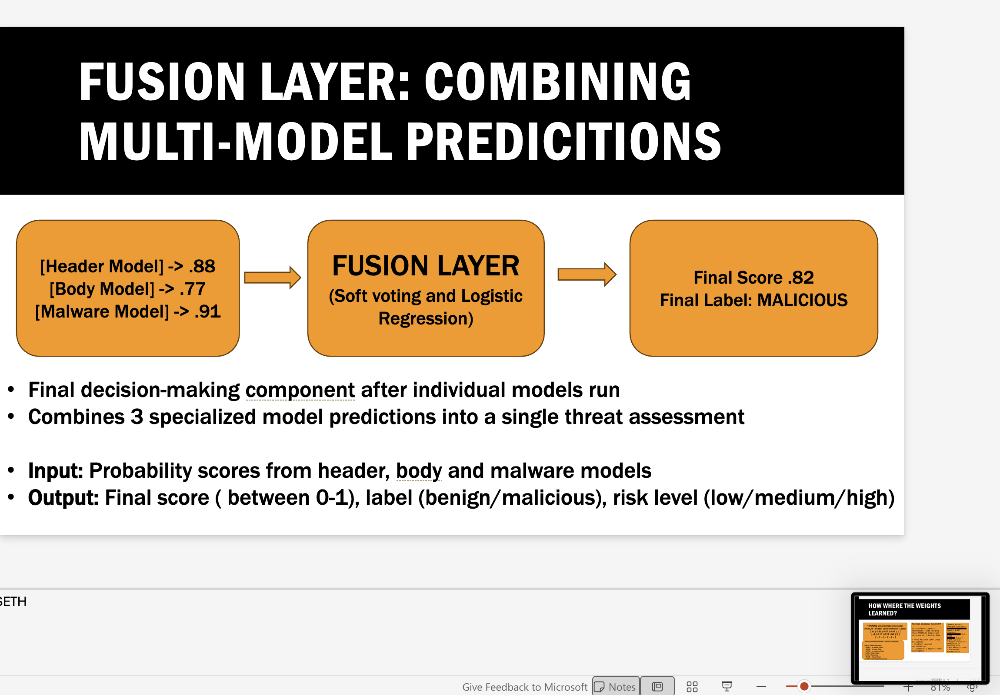

# Why the Weights Don't Add Up to 1 (And That's Correct!)

## THE QUESTION:
"The weights are 0.881, 0.692, and 0.376. These add up to 1.949, not 1. Is this an error?"

## SHORT ANSWER:
**No, this is correct!** Logistic regression coefficients do NOT need to sum to 1. They're not probabilities or proportions—they're weights in a mathematical formula.

---

## DETAILED EXPLANATION:

### Logistic Regression vs. Weighted Average

**SOFT VOTING (Weights sum to 1):**
```
Final = (w₁×header + w₂×body + w₃×malware)
where w₁ + w₂ + w₃ = 1

Example: (0.33×header + 0.33×body + 0.33×malware)
         0.33 + 0.33 + 0.33 = 1.0 ✓
```

**LOGISTIC REGRESSION (Weights can be ANY value):**
```
logit = intercept + (w₁×header + w₂×body + w₃×malware + ...)
final_score = sigmoid(logit)

Weights: 0.881, 0.692, 0.376
Sum: 1.949 (this is fine!)
```

---

## WHY LOGISTIC REGRESSION WEIGHTS CAN BE > 1 (or < 0):

### 1. They're Coefficients, Not Proportions

Logistic regression weights represent **how much each feature influences the logit** (the linear combination before sigmoid).

- A weight of 0.881 means "for every 1-unit increase in p_header, the logit increases by 0.881"
- These can be any real number: positive, negative, large, small
- They don't need to sum to anything specific

### 2. There Are More Than Just 3 Weights


```

All 8 coefficients together: -0.261 + 0.881 + 0.692 + 0.376 - 0.261 - 0.261 + 0.426 - 0.095 = **1.497**

This sum is meaningless—there's no requirement for it to be 1.

### 3. The Sigmoid Function Normalizes to [0, 1]

The raw logit can be any value (-∞ to +∞), but sigmoid transforms it to a probability:

```
final_score = 1 / (1 + e^(-logit))
```

**Example:**
```
If logit = 2.0:  sigmoid(2.0) = 0.88
If logit = -2.0: sigmoid(-2.0) = 0.12
If logit = 0:    sigmoid(0) = 0.50
```

The sigmoid does the normalization, not the weights!

---

## INTUITIVE ANALOGY:

Think of logistic regression like a **voting system with variable vote strength**:

**Soft Voting:**
- Each judge gets exactly 1 vote
- Votes must sum to total number of judges
- Equal power

**Logistic Regression:**
- Senior judge gets 0.881 votes (more influence)
- Junior judge gets 0.376 votes (less influence)  
- Votes don't need to sum to any specific number
- The sigmoid function interprets the total

---

## COMPARISON TABLE:

| Aspect | Soft Voting | Logistic Regression |
|--------|-------------|---------------------|
| **Weights sum to 1?** | Yes (required) | No (not required) |
| **Weight range** | [0, 1] | (-∞, +∞) |
| **Normalization** | By division | By sigmoid |
| **Example weights** | [0.33, 0.33, 0.33] | [0.881, 0.692, 0.376] |
| **Sum** | 1.0 | 1.949 (OK!) |

---

## FOR YOUR PRESENTATION:

**If someone asks: "Why don't the weights sum to 1?"**

**Answer:**

"Great question! That's because logistic regression coefficients aren't proportional weights—they're multiplicative factors in a linear combination. In soft voting, weights represent proportions of a total, so they sum to 1. But in logistic regression, weights represent how strongly each feature influences the final decision. They can be any value because the sigmoid function does the normalization to convert the linear combination into a probability between 0 and 1. So a weight of 0.881 just means 'header analysis has strong positive influence,' not 'header gets 88% of the vote.'"

**Shorter version:**

"Logistic regression weights don't sum to 1 because they're coefficients, not proportions. The sigmoid function handles the normalization to get us a probability between 0 and 1. The weights just show relative influence—header at 0.881 is 2.3× stronger than malware at 0.376."

---

## KEY TAKEAWAYS:

✓ **Weights summing to 1.949 is CORRECT**  
✓ **Logistic regression coefficients can be any value**  
✓ **Only soft voting requires weights to sum to 1**  
✓ **Sigmoid function provides the normalization**  
✓ **Relative magnitude matters, not absolute sum**

---

## MATHEMATICAL PROOF:

Let's verify with our example (email with header=0.88, body=0.77, malware missing):

```
Features: [0.88, 0.77, 0.50, 1, 1, 0, 2]

logit = -0.261 
      + (0.881 × 0.88)  = 0.775
      + (0.692 × 0.77)  = 0.533
      + (0.376 × 0.50)  = 0.188
      + (-0.261 × 1)     = -0.261
      + (-0.261 × 1)     = -0.261
      + (0.426 × 0)      = 0
      + (-0.095 × 2)     = -0.190
      
logit = 0.528

final_score = 1/(1 + e^(-0.528)) = 0.628
```

Notice:
- Weights sum to 1.949 (if we only count the first 3)
- Full coefficients sum to 1.497
- None of this matters!
- What matters: final_score = 0.628 is a valid probability ✓

---

## BONUS: Why Header is 2.3× Malware

When we say "header is 2.3× more influential than malware":

```
0.881 / 0.376 = 2.34
```

This ratio is meaningful because:
- For the same 1-unit increase in probability
- Header contributes 2.3× more to the logit
- This reflects header model's higher predictive power

The fact that 0.881 + 0.692 + 0.376 = 1.949 is irrelevant!
